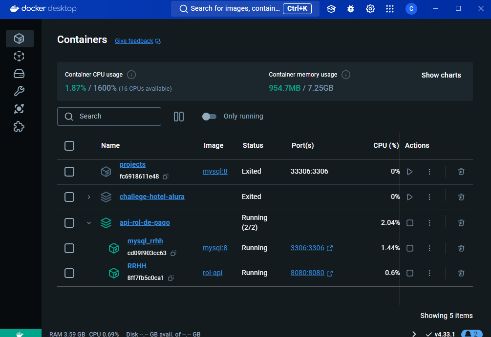

# API de Recursos Humanos

## Descripción

Esta API proporciona una serie de endpoints para realizar operaciones CRUD (Crear, Leer, Actualizar, Eliminar) en
diferentes entidades relacionadas con la gestión de recursos humanos en una organización. La API está construida
utilizando Spring Boot, Java 17, MySql y docker.

## Autenticación

La API utiliza autenticación basada en tokens. Los usuarios deben incluir un token de autorización válido en el
encabezado de sus solicitudes para acceder a los endpoints protegidos.

## Documentación y Pruebas

La documentación completa de la API, incluyendo detalles sobre los endpoints, parámetros de solicitud y respuestas
esperadas, está disponible en Swagger UI. Puedes acceder a la documentación del api
en [Swagger UI](http://localhost:8080/swagger-ui/index.html#/).

## Requisitos

Para utilizar esta API, es necesario contar con permisos de acceso y autenticación mediante tokens de autorización.
Asegúrate de incluir el token de autorización en el encabezado de tus solicitudes asegurate de registrarte primero en la
apliacion para poder usar los demas endpoints esta ruta.


## Ejemplos de Uso

A continuación se presentan algunos ejemplos de cómo interactuar con la API utilizando herramientas como cURL o Postman:

### Ejemplo con Curl

```bash
curl -X GET -H "Authorization: Bearer {tu_token}" http://localhost:8080/api/allUser

curl -X DELETE http://localhost:8080/api/document/123

curl -X POST -H "Content-Type: application/json" -H "Authorization: Bearer {tu_token}" -d '{"name": "John", "lastname": "Doe", "email": "john@example.com", "psw": "password123", "phone": "1234567890", "status": 1}' http://localhost:8080/api/user

```

### Base de datos


### Publicación de la api en docker

- Si todo sale bien se les debe crear un contenedor con los recursos de la api para su funcionamiento

### Documentacion con Swagger


